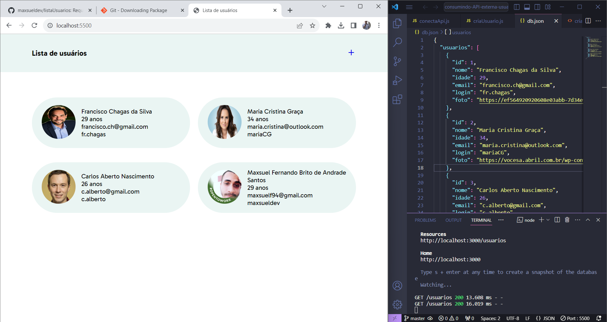
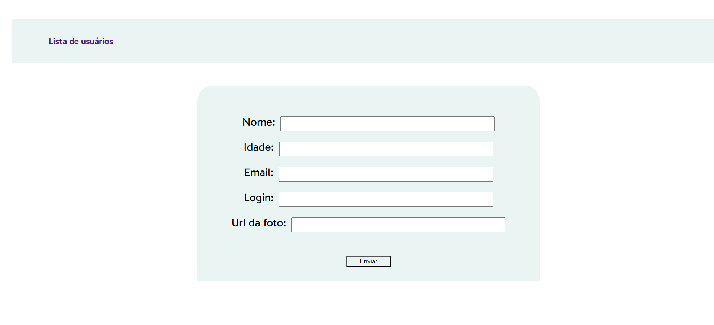

# listaUsuarios


## Sobre o projeto
Requisições GET e POST para listar e criar novos usuários vindo de uma API externa
<br>

### Layout Mobile First




<br>

## Tecnologias utilizadas

### Front-End
* HTML / CSS / JS Assíncrono

<br>

## Como executar o projeto
```bash
# clonar repositório
git clone git@github.com:maxsueldev/listaDeCompras.git

# json-server
instalar o pacote npm json-server ´npm install json-server´
fazer com que o json-server escute a api-externa  ´npx json-server --watch db.json´

# entrar na pasta do projeto e abrir o arquivo index.html ou dar um go live com a extensão Live Server
```

<br>

## Autor
Maxsuel Santos

<https://www.linkedin.com/in/maxsuelfernandob/>
